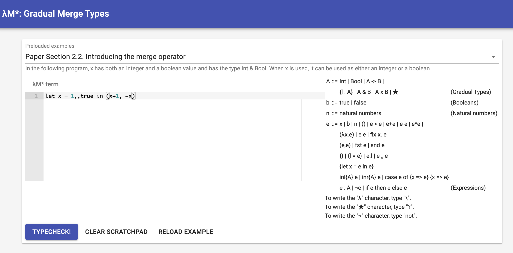

# Merging Gradual Typing (Artifact)

## Introduction

* `Coq-proof` contains the Coq formulation of λM, λM* and GTFL calculus.
It can either be compiled in the pre-built docker image with all the 
dependencies installed or it could be built from the scratch.

* `Prototype` contains a web executable model of λM*, implemented in Scala and React.js. The prototype shows interactive typing and reduction derivations.

## Hardware Dependencies

The Docker images can run on any machine that supports the `linux/amd64` architecture.


## Getting Started

### Coq Proofs

You can pull the docker image `mgt-oopsla24` and run the image by the following command:

```
docker run -it wenjiaye/mgt-oopsla24:v1
```

There are two folders with make file in each and
go to each folder and run make:

1. `$ cd /home/M`
2. `$ eval $(opam env)`
3. `$ make`

or

1. `$ cd /home/MD`
2. `$ eval $(opam env)`
3. `$ make` 


### Prototype

#### Running the prototype with Docker

- Go to the binaries folder:
  ```sh
  cd binaries
  ```

- To build the image using Docker you can run the following command:
  ```sh
  docker build -t gmt:latest .
  ```

- Then to create a container and enter bash mode:
  ```sh
  docker run -p 9000:9000 -it gmt:latest /bin/bash
  ```
  Make sure port 9000 is open, otherwise you can change it to another. For instance, to change it to 8080, do as follows:
  ```sh
  docker run -p 8080:9000 -it gmt:latest /bin/bash
  ```

- Finally to run the application, go to the `gmt-0.9` folder:
  ```sh
  cd gmt-0.9
  ```
- And then run:
  ```sh
  ./bin/gmt
  ```
  This should start a server in the port 9000. To open the prototype, go to http://localhost:9000/gmt/ on any browser.

#### Running the prototype locally 
To run the prototype locally, all you need is Java 1.8. Also, check that you have Java 1.8 in the path.

+ JDK8 (https://www.oracle.com/technetwork/java/javase/downloads/)

The following instructions are Unix valid commands. If you have Windows installed in your machine, you need to perform the corresponding commands.
- Unzip the file.
  ```sh
  unzip gmt-0.9.zip
  ```
- Go to the `gmt-0.9` folder:
  ```sh
  cd gmt-0.9
  ```
- Add run permissions to the binary file:
  ```sh
  chmod +x bin/gmt
  ```
- And then run:
  ```sh
  ./bin/gmt
  ```
  This should start a server in the port 9000. To open the prototype, go to http://localhost:9000/gmt/
- In case the port 9000 is already taken, run:
  ```sh
  ./bin/gmt -Dhttp.port=<available-port-number>
  ```
  
#### Using the online interpreter

The following screenshot shows how the prototype implementation looks like.



Given a source program, the application shows its typing and reduction derivations. Let us see λM* in action by running a simple example.

1. Write the following code in the big text area:
   ```
   let x = (1,,true) : ★ in
   x + 1
   ```
   To write <code>★</code> you can type <code>?</code>. Similarly, 
   To write the `λ` character, type `\`, and to write the `¬` character, type "not".

2. To typecheck the example and compile it to λM* click in the $\mathsf{TYPECHECK!}$ button.

   

3. To reduce the program we click in the $\mathsf{REDUCE!}$ buton.

   

   Each step shows the current redex in red. Note as programs may loop infinitely, the prototype only presents the first 20 steps of reduction. If after 20 reduction steps the program is still reducible, another button is presented to reduce another 20 steps. 

   The reduction of the program is presented as the reduction of type derivation trees.
   Each derivation tree can be expanded by clicking the button on the top-right corner:
   

4. To reduce the second example write the following in the text area:
   ```
   let x = (1,,true) : ★ in
   x 1
   ```
   and follow the previous steps:
   

   This time, the program reduces to an runtime error when reducing the ```x 1``` subexpression, as it cannot extract a function from the merge expression.

5. Now consider a third evolution of the last program:
   ```
   let x = (1,,true) : int&bool in
   x 1
   ```
   and follow the previous steps, you will get a static type error:
   
   because it detects during typing that is not possible to extract a function for the `int&bool` intersection type.


## Step-by-Step Instructions

### Coq Proofs


#### 1) Docker Image

You can pull the docker image `mgt-oopsla24` and run the image by the following command:

```
docker run -it wenjiaye/mgt-oopsla24:v1
```

There are two folders with make file in each and
go to each folder and run make:

1. `$ cd /home/M`
2. `$ eval $(opam env)`
3. `$ make`
4. You should see something like the following:
```
_CoqProject && coq_makefile -arg '-w -variable-collision,-meta-collision,-require-in-module' -f _CoqProject -o CoqSrc.mk
make[1]: Entering directory '/home/M'
COQDEP VFILES
COQC LibTactics.v
COQC syntax_ott.v
COQC rules_inf.v
COQC Infrastructure.v
COQC Typing.v
COQC Subtyping_inversion.v
COQC Key_Properties.v
COQC Deterministic.v
COQC Type_Safety.v
make[1]: Leaving directory '/home/M'
```
execution time about : 1m47.478s


1. `$ cd /home/MD`
2. `$ eval $(opam env)`
3. `$ make` 
4. You should see something like the following:
```
_CoqProject && coq_makefile -arg '-w -variable-collision,-meta-collision,-require-in-module' -f _CoqProject -o CoqSrc.mk
make[1]: Entering directory '/home/MD'
COQDEP VFILES
COQC LibTactics.v
COQC syntax_ott.v
COQC rules_inf.v
COQC Infrastructure.v
COQC Subtyping_inversion.v
COQC Typing.v
COQC Key_Properties.v
COQC Deterministic.v
COQC Static.v
COQC Type_Safety.v
COQC agt.v
COQC criteria.v
make[1]: Leaving directory '/home/MD'
```
execution time : 3m24.214s


#### 2) Build from Scratch 

This section explains how to build the artifact from scratch

##### Prerequisites

1. Install Coq 8.10.2.
   The recommended way to install Coq is via `OPAM`. Refer to
   [here](https://coq.inria.fr/opam/www/using.html) for detailed steps. Or one could
   download the pre-built packages for Windows and MacOS via
   [here](https://github.com/coq/coq/releases/tag/V8.10.2). Choose a suitable installer
   according to your platform.

2. Make sure `Coq` is installed (type `coqc` in the terminal, if you see "command
   not found" this means you have not properly installed Coq), then install `Metalib`:
   1. Open terminal
   2. `git clone https://github.com/plclub/metalib`
   3. `cd metalib/Metalib`
   4. Make sure the version is correct by `git checkout 597fd7d`
   5. `make install`


##### Build and Compile the Proofs

1. Enter `Coq-proof/M` or `Coq-proof/MD`  directory.

2. Please make sure to run the command `eval $(opam env)` before running make if 
   you installed the Coq via opam. 

3. Type `make` in the terminal to build and compile the proofs.

4. For `M`, you should see something like the following:
```
_CoqProject && coq_makefile -arg '-w -variable-collision,-meta-collision,-require-in-module' -f _CoqProject -o CoqSrc.mk
COQDEP VFILES
COQC LibTactics.v
COQC syntax_ott.v
COQC rules_inf.v
COQC Infrastructure.v
COQC Typing.v
COQC Subtyping_inversion.v
COQC Key_Properties.v
COQC Deterministic.v
COQC Type_Safety.v
```
execution time about : 1m35.852s

For `MD`, you should see something like the following:
```
_CoqProject && coq_makefile -arg '-w -variable-collision,-meta-collision,-require-in-module' -f _CoqProject -o CoqSrc.mk
COQDEP VFILES
COQC LibTactics.v
COQC syntax_ott.v
COQC rules_inf.v
COQC Infrastructure.v
COQC Subtyping_inversion.v
COQC Typing.v
COQC Key_Properties.v
COQC Deterministic.v
COQC Static.v
COQC Type_Safety.v
COQC agt.v
COQC criteria.v
```
execution time : 2m20.491s


### Prototype

#### Installation instructions

We provide four means of installation:

1. **Execution of binaries with Docker**.
2. **Compilation and execution of the source code using Docker**.
3. **Local execution of binaries**.
4. **Local compilation and execution of the source code**.


##### 1.- Execution of binaries using Docker

- Go to the binaries folder:
  ```sh
  cd binaries
  ```

- To build the image using Docker you can run the following command:
  ```sh
  docker build -t gmt:latest .
  ```
- Then to create a container and enter bash mode:
  ```sh
  docker run -p 9000:9000 -it gmt:latest /bin/bash
  ```
  Make sure port 9000 is open, otherwise you can change it to another. For instance, to change it to 8080, do as follows:
  ```sh
  docker run -p 8080:9000 -it gmt:latest /bin/bash
  ```

- Finally to run the application, go to the `gmt` folder:
  ```sh
  cd gmt-0.9
  ```
- And then run:
  ```sh
  ./bin/gmt
  ```
  This should start a server in the port 9000. To open the prototype, go to http://localhost:9000/gmt/ on any browser.


##### 2.- Compilation and execution of the source code using Docker


- Go to the sources folder:
  ```sh
  cd sources
  ```

- To build the image using Docker you can run the following command:
  ```sh
  docker build -t gmt-sources:latest .
  ```
- Then to create a container and enter bash mode:
  ```sh
  docker run -p 9000:9000 -it gmt-sources:latest /bin/bash
  ```
  Make sure port 9000 is open, otherwise you can change it to another. For instance, to change it to 8080, do as follows:
  ```sh
  docker run -p 8080:9000 -it gmt-sources:latest /bin/bash
  ```

- To compile the application, go to the `gmt` folder:
  ```sh
  cd gmt
  ```

The source code is composed of a frontend and a backend application.
The backend is a simple web application implemented using the Play framework, which uses the implemented gradual language to illustrate type derivations in an interactive interface implemented in React. 
**All the important files related to the paper (the implementation of the language itself) are in the `app/glang` folder**.

We can proceed to compile the frontend, or skip this and go straight to compile the backend (frontend is pre-compiled in location <code>public/javascript/app.js</code>.


###### Compiling the frontend
To compile this javascript file, you have to enter the node folder first. 
1. From the application folder:
   ```sh
   cd node
   ```
2. Then we have to install node packages (it may take a while).
   ```sh
   npm i
   ```
3. Then once all the packages have been installed, we proceed to build and copy the generated javascript file into the web server. There is a convenient file that does this called ```make```. 
   ```sh
   ./make
   ```
   If the file does not have permission to run, then execute the following: 
   ```sh
   chmod +x make
   ```

###### Compiling the backend
1. From the application folder (`gmt`) we start SBT: 
   ```sh
   sbt
   ```

 2. Then we compile the application as follows (it may take a while the first time):
    ```sh
    compile
    ```

###### Running the application
1. From the application folder we start SBT (unless you already started it): 
    ```sh
    sbt
    ```
2. Then we start the web application as follows:
    ```sh
    run
    ```
    This should start a server in the port 9000. To open λM*, go to http://localhost:9000/gmt/
3. In case the port 9000 is already taken, run:
    ```sh
    run [available-port-number]
    ```


###### Distributing the application
1. From the application folder we start SBT (unless you already started it): 
   ```
   sbt
   ```
    
    
2. Then to generate a zip file with all the binaries we execute:
   ```sh
   dist
   ```


SBT will generate the zip file located at `target/universal/gmt-0.9.zip`

    

##### 3.- Local execution of binaries

To run the prototype locally, all you need is Java 1.8. Also, check that you have Java 1.8 in the path.

+ JDK8 (https://www.oracle.com/technetwork/java/javase/downloads/)

Then you need to follow the Docker instructions about running the binaries modulo the dockers commands.


##### 4.- Local compilation and execution of the source code

To compile λM* you need to have installed:
  - SBT 1.5.5 (http://www.scala-sbt.org/)
  - Node v18.18.0 (https://nodejs.org/)
  - JDK8 (https://www.oracle.com/technetwork/java/javase/downloads/)

To install this versions specifically, you can use SDKMAN (https://sdkman.io/), and Node Version Manager (https://github.com/nvm-sh/nvm).
With SDKMAN you can install SBT and JDK as follows:
```sh
sdk install java 8.0.412-amzn
sdk install sbt 1.5.5
sdk use java 8.0.412-amzn
```

With NVM you can install the exact version of node by running:
```sh
nvm install 18.18.0
nvm use 18.18.0
```

Then you need to follow the Docker instructions about compiling the sources files modulo the dockers commands.


  
## Proof Correspondence

If a reader wishes to reuse the proofs provided, they can refer to the `syntax_ott.v` file and modify the syntax to suit their needs.

Then we show some important Lemmas and theorems correspondence with the coq formalization. The following table shows the correspondence between lemmas discussed in paper and their source coq codes. For example, one can find the `Lemma 3.3` in file `M/Deterministic.v` and the definition name in file is `Cast_unique`.


| Theorems/Definitions | Description           | Files                         | Name in Coq                 |
|----------------------|-----------------------|-------------------------------|-----------------------------|
| Fig. 2               | Syntax                | M/syntax\_ott.v           |                             |
| Fig. 3               | Typing                | M/syntax\_ott.v           | Typing                      |
| Fig. 4               | Subtype               | M/syntax\_ott.v           | sub                         |
| Fig. 4               | COST                  | M/syntax\_ott.v           | co                          |
| Definition 3.1       | Disjointness          | M/syntax\_ott.v           | disjointSpec                |
| Fig. 5         | Casting               | M/syntax\_ott.v           | Cast                          |
| Fig. 5         | Reduction             | M/syntax\_ott.v           | step                          |
| Lemma 3.3      | Determinism(casting)  | M/Deterministic.v         | Cast\_unique                  |
| Lemma 3.4      | Preservation(casting) | M/Type_Safety.v          | Cast\_preservation            |
| Lemma 3.5      | Progress(casting)     | M/Type_Safety.v         | Cast\_progress                |
| Lemma 3.6      | Dynamic types         | M/Typing.v                | principal\_inf                |
| Theorem 3.7   | Determinism           | M/Deterministic.v         | step\_unique                  |
| Theorem 3.8   | Preservation          | M/Type\_Safety.v          | preservation                  |
| Theorem 3.9   | Progress              | M/Type\_Safety.v          | Progress                      |
| Fig. 6         | Syntax                | MD/syntax\_ott.v          |                               |
| Fig. 7         | Consistency           | MD/syntax\_ott.v          | sim                           |
| Fig. 7         | Subtyping             | MD/syntax\_ott.v          | sub                           |
| Fig. 7         | Consistent Subtyping  | MD/syntax\_ott.v          | csub                          |
| Fig. 7         | Precision             | MD/syntax\_ott.v          | tpre                          |
| Lemma 4.1      | Consistent Subtype    | MD/Subtyping\_inversion.v | consub\_prop                  |
| Lemma 4.1      | Consistent Subtype    | MD/Subtyping\_inversion.v | consub\_propr            |
| Definition 4.2 | Disjointness          | MD/syntax\_ott.v          | DisjointSpec                 |
| Fig. 8         | Casting               | MD/syntax\_ott.v           | Cast                         |
| Fig. 9         | Reduction             | MD/syntax\_ott.v           | step                          |
| Theorem 4.3    | Determinism           | MD/Deterministic.v        | step\_unique                  |
| Theorem 4.4    | Preservation          | MD/Type\_Safety.v         | preservation                  |
| Theorem 4.5    | Progress              | MD/Type_Safety.v         | Progress                      |
| Fig. 10        | Precision             | MD/syntax\_ott.v          | precise                       |
| Theorem 5.1    | Equivalence(static)   | MD/Static.v               | static_dtyping_dyn          |
| Theorem 5.1    | Equivalence(static)   | MD/Static.v               | static_Typing_dyn           |
| Theorem 5.2    | Equivalence(dynamic)  | MD/Static.v               | static_ddstep_dyn      |
| Theorem 5.2    | Equivalence(dynamic)  | MD/Static.v               | static_stepd_dyn       |
| Theorem 5.3    | SGG                   | MD/criteria.v             | SGG_both                     |
| Fig. 11        | GTFL                  | MD/agt.v          |                        |
| Definition 5.4 | Translation  | MD/agt.v               | transt        |
| Definition 5.5 | Translation  | MD/agt.v               | transg        |
| Theorem 5.6    | AGT                   | MD/agt.v               | AGT_Soundness|
| Fig. 13               | Well-formedness       | M/syntax\_ott.v           | well                        |
| Fig. 13               | Projection            | M/syntax\_ott.v           | get\_ty                     |
| Fig. 13         | Wellformed             | MD/syntax\_ott.v          | well                         |
| Fig. 13         | Projection             | MD/syntax\_ott.v          | get\_ty                      |
| Fig. 13               | Label presence        | M/syntax\_ott.v           | ityp                        |
| Fig. 14               | CBN             | MD/syntax\_ott.v                | cbn                         |


## Checking Axioms

To check the axioms that out proofs rely on, you can use `Print Assumptions theorem_name.` in Coq.
For example, by adding `Print Assumptions preservation.` to the end of `TypeSafety.v` and `make clean` then re-run `make`, you will see:

 ```
Axioms:
JMeq_eq : forall (A : Type) (x y : A), x ~= y -> x = y
 ```
It should be the only axiom that the theorem relies on, which is introduced by the use of dependent induction.
